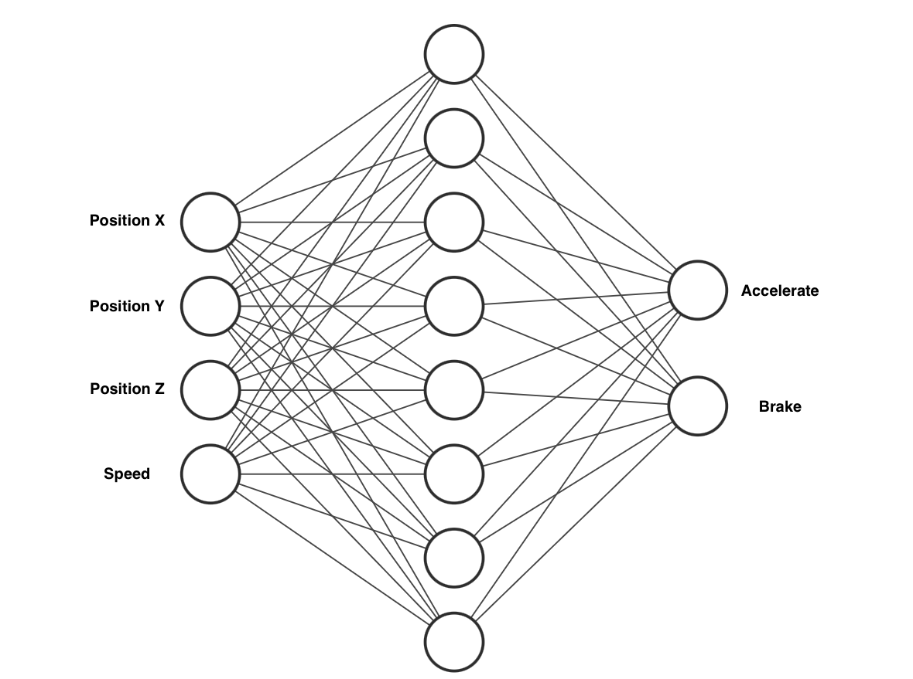
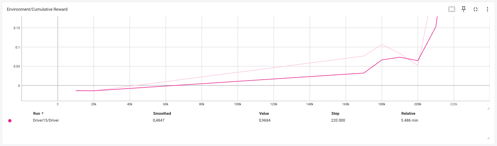
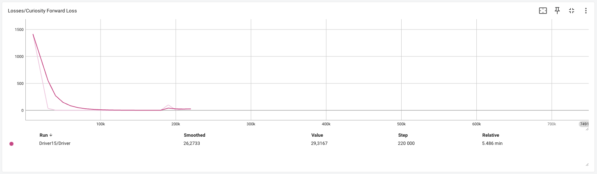
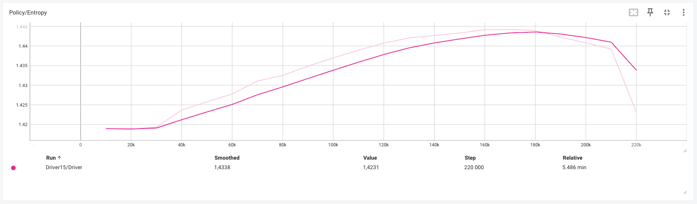
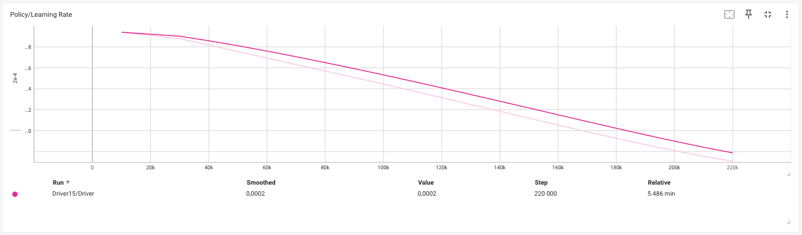

# Inteligência Artificial Aplicada a Jogos *(IAAJ)*

# Técnica #3 - Aprendizagem por Reforço
Para efetuar esta técnica foi utilizado o [ML Agents](https://github.com/Unity-Technologies/ml-agents), em que consiste um agente que vai aprender como conduzir um veículo e ao longo dos episódios irá aumentar o
grau de complexidade como introduzir mais parametros e obstáculos.

## Instalar bibliotecas necessárias:
Antes de avançar-mos para a próxima etapa, é necessário instalar algumas bibliotecas, como alternativa podemos seguir através desta [guia](https://unity-technologies.github.io/ml-agents/Installation/).
```bash
conda create -n mlagents python=3.10.12 && conda activate mlagents
pip3 install torch~=2.2.1 --index-url https://download.pytorch.org/whl/cu121
pip3 install grpcio (Apenas no MacOS)
```

## Como dar setup ao projeto:
Depois de executar estes comandos todos, podemos abrir o projeto de unity na pasta `./Game` e pronto para começar com as aprendizagens.
```bash
conda activate mlagents
git clone https://github.com/0rangeFox/AI-Unity-Project
cd ./AI-Unity-Project
git submodule update --init
python -m pip install ./ml-agents-envs
python -m pip install ./ml-agents
cd ./Game/Assets/Configurations;
conda activate mlagents;
mlagents-learn driver_config.yaml --run-id=Driver_0;
```

## Episódio 1 - Aprender como acelerar e travar
No primeiro episódio, vamos ensinar o agente só para acelerar e travar, com o seguinte gráfico, podemos
observar que o nosso agente irá ter apenas 4 entradas e 2 saídas de valores.



Com o seguinte vídeo podemos observar o treino num mapa em que contêm apenas uma estrada e uma meta (Poste preto),
concluimos que nestes resultados com uma duracao aproximada de 6 minutos em aprendizagem, o agente conseguiu praticar a acelaração e travagem com perfeição.







## Episódio 2 - Aprender como guiar
Neste episódio, o agente tem como objetivo de saber como dirigir o veículo depois de praticar com acelerar e travar,
podemos tirar conclusões que já 
