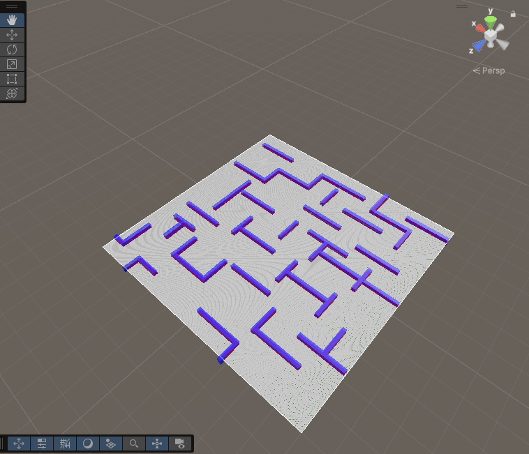
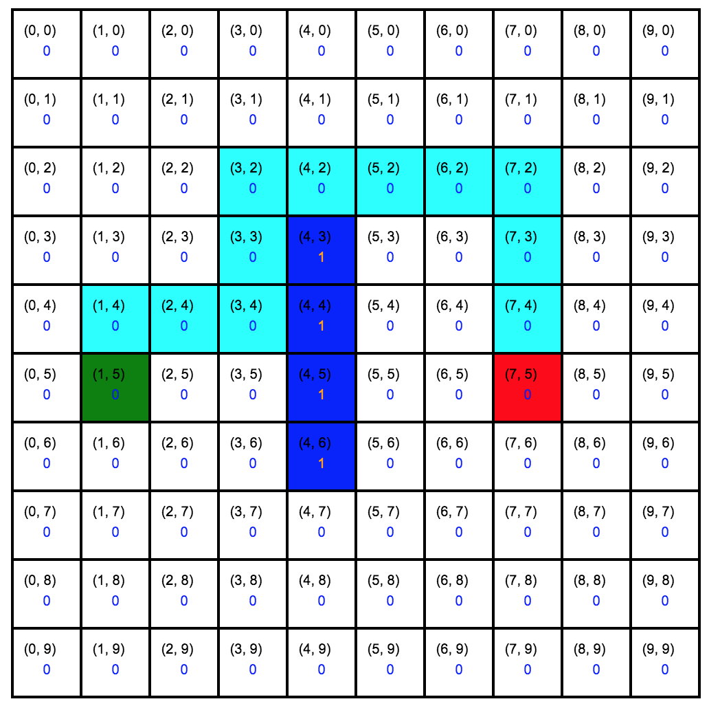
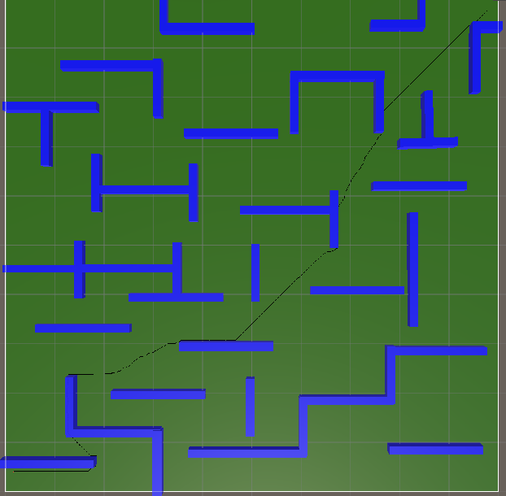

# Inteligência Artificial Aplicada a Jogos *(IAAJ)*

# Técnica #1 - Pathfinding Dijkstra

O algoritmo Dijkstra é usado para encontrar o caminho mais curto de um ponto inicial para todos os outros pontos (ou como neste caso para um destino específico) em um grafo com pesos não negativos.

O Dijkstra, diferente do A*, só faria uso do Custo de Movimento(gCost, mas neste caso é utilizado um dicionário com função similar) e não tem a necessidade de usar Custo Heurístico (hCost) (e por consequência também não faz uso do Custo Total (fCost)).

- Grid e Nós

A área de jogo é a mesma que a do algoritmo A*. E cada nó tem como propriedades:
	
    walkable: Define se o nó é navegável ou está bloqueado por um obstáculo.
    worldPosition: A posição do nó no mundo 3D.
    gCost, hCost, fCost: O algoritmo Dijkstra não faz uso de nenhum dos custos. Em vez disso utiliza um dicionário próprio(distances) para armazenar o custo acumulado (similar a gCost).
    parent: Referência ao nó anterior no caminho, mas o algoritmo Dijkstra usa o dicionário previousNodes alternativamente.

- Heap Binária

 A Heap garante que o nó com a menor distância (menor custo acumulado) seja sempre o próximo a ser processado, o que é essencial para Dijkstra. Para além que uso da Heap acelera o processamento dos nós.  

- Fluxo do Algoritmo
	
	Inicialização

	   São criados 2 dicionários:
		Dicionário distances: Armazena a menor distância conhecida do nó inicial a cada nó no grafo. Neste o nó inicial recebe distância 0 e os restantes nós recebem distância infinita(neste caso o valor máximo de int).
		Dicionário previousNodes: Armazenar o nó anterior no caminho mais curto para cada nó (usado para reconstruir o caminho no final).
	   São criadas as estruturas Heap(contém o nó inicial com distância 0) e HashSet que são utilizadas para armazenar nós não visitados e nós visitados respetivamente.	


        Exploração
	   
	   O nó com a menor distância atual da Heap é retirado e este passa a ser o currentNode e é então processado.
		Se um vizinho não for "walkable" ou já estiver explorado, este é ignorado.
		Senão avalia-se se newDistance é menor que a distância atual do vizinho, a distância no dicionário distances é atualizado com a nova distância, o currentNode é adicionado ao dicionário previousNodes e o vizinho é adicionado á Heap se já não lá tiver.
		Quando todos os vizinhos do currentNode tiverem sido processados, este é adicionado ao conjunto de nós visitados.
	   Se o currentNode for o nó final, o algoritmo para e reconstrói o caminho usando o previousNodes.

        Reconstrução do Caminho
	   Ao encontrar o nó final caminho mais curto é reconstruído começando do nó final seguindo os "nós anteriores" no dicionário previousNodes até o nó inicial.

# Técnica #2 - Pathfinding A*

Objetivo:
Implementar o algoritmo A* para encontrar o caminho mais curto entre dois pontos num grid, otimizando-o com o uso de um heap. Este documento explica, passo a passo, como o algoritmo foi implementado e utilizado.

Passo 1: Configurar o Grid

O que foi feito:

    Foi criada a classe Node para representar cada célula do grid.
    Cada Node tem:
        Posição no mundo: Coordenadas no Unity.
        Propriedade walkable: Indica se o nó é navegável.
        Custos do A*: gCost, hCost e fCost.



Nesta imagem podemos observar os nodes walkables (em branco) e os unwalkable (em vermelho).

Passo 2: Implementar o Algoritmo A*

O que foi feito:

    Criei duas listas para armazenar os nós:
        Lista aberta (free): Nós a explorar.
        Conjunto fechado (visited): Nós já explorados.
    De seguida adicionei a lógica para:
        Escolher o nó com menor fCost na lista aberta.
        Explorar os vizinhos navegáveis.
        Retroceder pelos nós pais para construir o caminho.

Fluxo do Algoritmo



Inicializa no startNode(1,5).
Verifica os vizinhos do nó atual.
Escolhe o vizinho com o menor fCost.
Verifica se o node atual é o targetNode(7,5).
Caso não seja, volta a repetir o ciclo até encontrar o targetNode.

Passo 3: Otimização do A* com Heap

O que foi feito:

    Implementei a classe Heap para gerir os nós na lista aberta.
    O heap reduz a complexidade da operação de obtenção do menor nó de O(n) para O(logn).

Passo 4: Traçar o Caminho

O que foi feito:

    Depois de encontrar o nó final, retrocede pelos nós pais para construir o caminho.
    Guarda este caminho numa lista path.



# Resultados de Pathfinding: Dijkstra & A*
Ao verificar os resultados, constatamos que o algoritmo A* é mais rápido e otimizado que o algoritmo Dijkstra.

| Pathfinding | Média de Tempo | Média de Ciclos |
|:-----------:|:--------------:|:---------------:|
|  Dijkstra   |    ~3159ms     |     ~626759     |
|     A*      |     ~2387ms     |     ~585547      |

# Técnica #3 - Aprendizagem por Reforço
Para efetuar esta técnica, foi utilizado o [ML Agents](https://github.com/Unity-Technologies/ml-agents), que consiste num agente que irá aprender a conduzir um veículo e, ao longo dos episódios, irá aumentar o grau de complexidade, introduzindo mais parâmetros e obstáculos.

## Instalar bibliotecas necessárias:
Antes de avançarmos para a próxima etapa, é necessário instalar algumas bibliotecas. Como alternativa, podemos seguir através deste [guia](https://unity-technologies.github.io/ml-agents/Installation/).

```bash
conda create -n mlagents python=3.10.12 && conda activate mlagents
pip3 install torch~=2.2.1 --index-url https://download.pytorch.org/whl/cu121
pip3 install grpcio (Apenas no MacOS)
```

## Como dar setup ao projeto:
Depois de executar todos estes comandos, podemos abrir o projeto Unity na pasta `./Game` e estamos prontos para começar as aprendizagens.

```bash
conda activate mlagents
git clone https://github.com/0rangeFox/AI-Unity-Project
cd ./AI-Unity-Project
git submodule update --init
python -m pip install ./ml-agents-envs
python -m pip install ./ml-agents
cd ./Game/Assets/Configurations;
conda activate mlagents;
mlagents-learn driver_config.yaml --run-id=Driver_0;
```

## Episódio 1 - Aprender como acelerar e travar
No primeiro episódio, vamos ensinar o agente apenas a acelerar e a travar. Com o seguinte gráfico, podemos observar que o nosso agente terá apenas 4 entradas e 2 saídas de valores.


Com o seguinte vídeo, podemos observar o treino num mapa que contém apenas uma estrada e uma meta (poste preto). Concluímos que, com uma duração aproximada de 6 minutos de aprendizagem, o agente conseguiu praticar a aceleração e a travagem com perfeição.


## Episódio 2 - Aprender como guiar
Neste episódio, o agente tem como objetivo aprender a dirigir o veículo, depois de ter praticado a aceleração e a travagem. Com o seguinte gráfico, podemos observar que agora há mais 3 novas entradas e 1 nova saída de valores.


Ao final do vídeo, podemos observar que o mapa tem um obstáculo no meio da estrada. Podemos tirar conclusões a partir destes resultados: com uma duração aproximada de 42 minutos de aprendizagem, o agente ainda não se encontra estável e é necessário mais tempo de treino.


Por fim, apresentamos todos os resultados no mesmo gráfico para uma comparação mais fácil.


