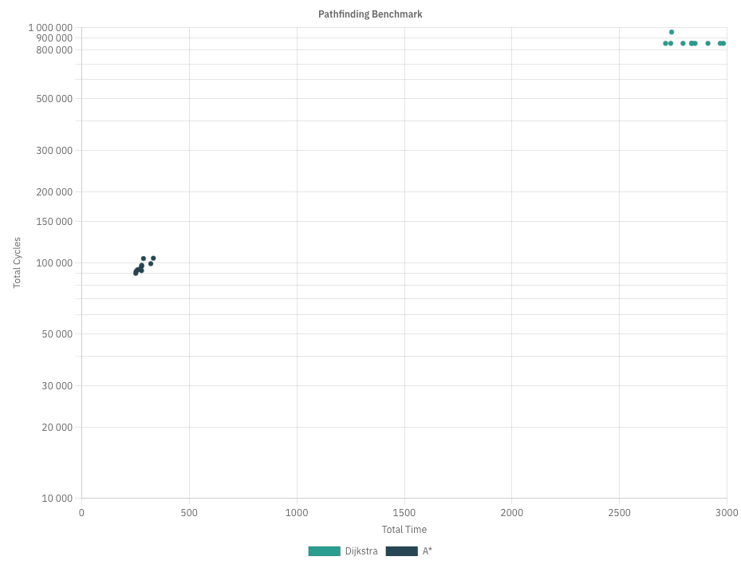
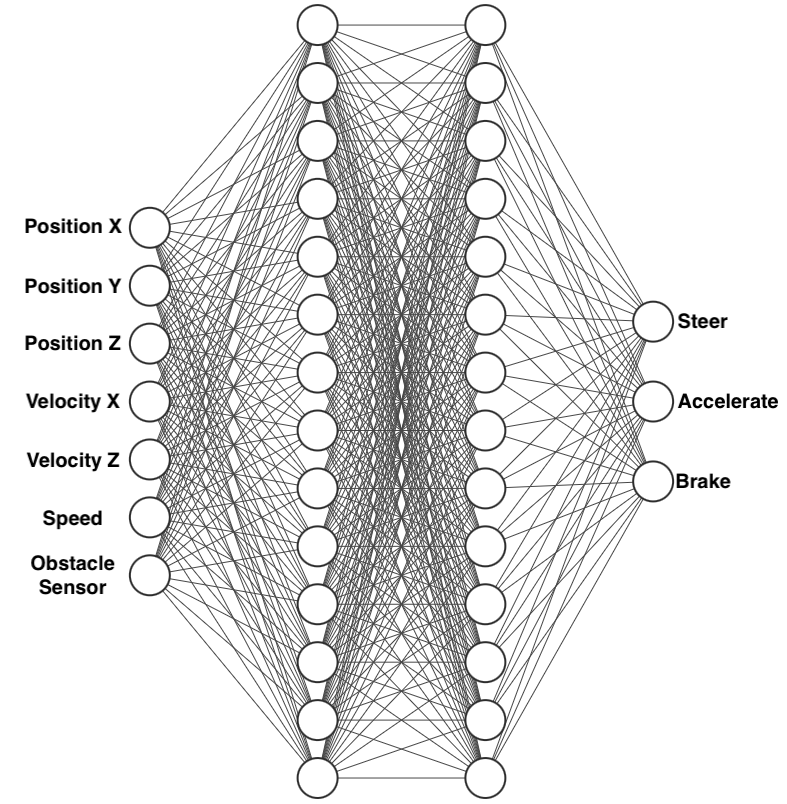
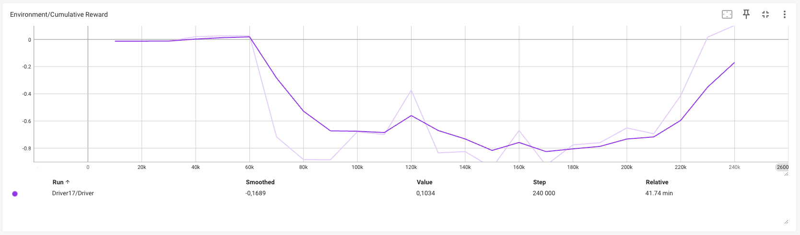
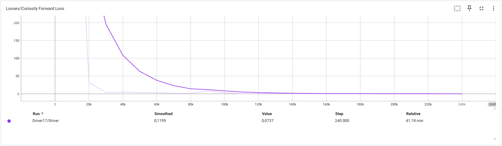
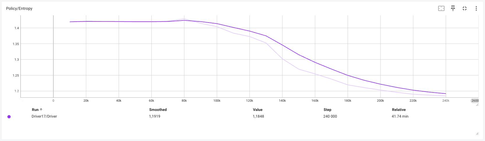
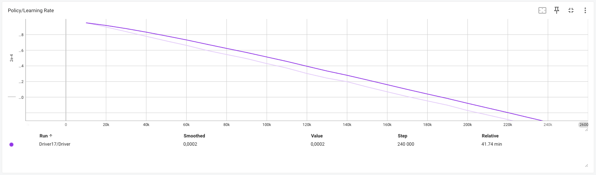
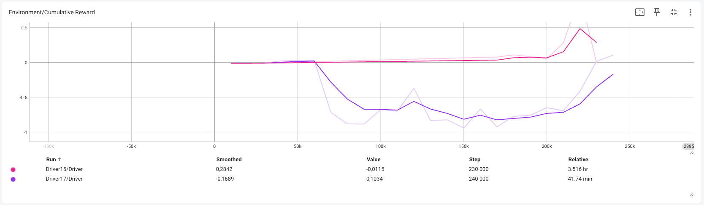
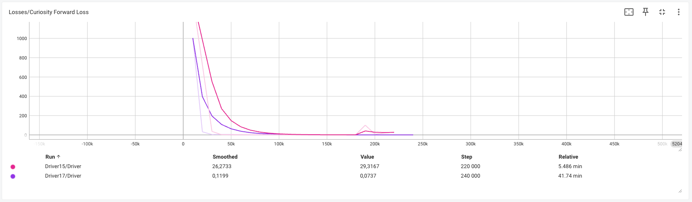
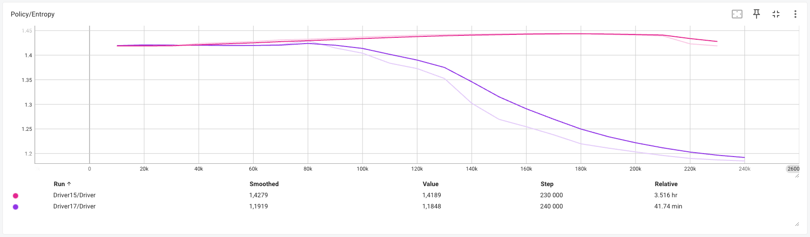
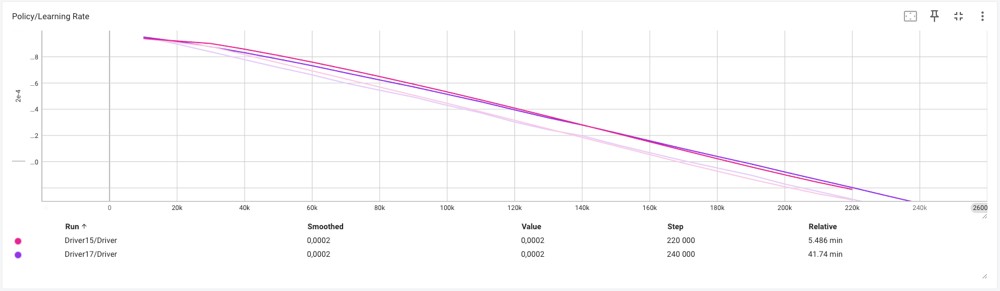

# Inteligência Artificial Aplicada a Jogos *(IAAJ)*

# Técnica #1 - Pathfinding Dijkstra

# Técnica #2 - Pathfinding A*

O algoritmo A* é utilizado em inteligência artificial para jogos devido à sua eficiência em encontrar caminhos. Ele combina:

    Custo de Movimento (gCost): A distância acumulada desde o nó inicial até o nó atual.
    Custo Heurístico (hCost): A estimativa da distância restante do nó atual até o nó final (normalmente calculada usando a distância Manhattan ou Euclidiana).
    Custo Total (fCost): A soma dos dois valores anteriores (fCost=gCost+hCostfCost=gCost+hCost).

O A* funciona explorando os nós mais promissores (menor fCost) primeiro, até alcançar o destino.

- Grid e Nós

A área de jogo é representada como um grid composto por nós. Cada nó possui as seguintes propriedades:

    walkable: Define se o nó é navegável ou está bloqueado por um obstáculo.
    worldPosition: A posição do nó no mundo 3D.
    gCost, hCost, fCost: Custos usados pelo algoritmo A*.
    parent: Referência ao nó anterior no caminho, usada para reconstruir o caminho final.

- Heap Binária

Para otimizar a busca do nó com o menor custo na lista de nós a explorar, utilizamos uma Heap Binária:

    Permite operações de busca e remoção do menor elemento em O(log n).
    A heap mantém a ordem baseada no fCost, priorizando os nós com menor custo.

Fluxo do Algoritmo

    Inicialização
        O algoritmo começa por adicionar o nó inicial à heap.
        A heap é usada como lista de nós "abertos" (não visitados).

    Exploração
        Retira-se o nó com o menor fCost da heap.
        Se este nó for o nó-alvo, o caminho é encontrado.
        Caso contrário, os vizinhos do nó atual são avaliados:
            Se um vizinho não for "walkable" ou já estiver explorado, é ignorado.
            Caso contrário, calcula-se o custo acumulado até o vizinho (gCost) e, se necessário, atualiza-se o nó na heap.

    Reconstrução do Caminho
        Quando o nó-alvo é alcançado, o caminho é reconstruído seguindo os parent de cada nó desde o destino até à origem.

# Resultados de Pathfinding: Dijkstra & A*
Ao verificar os resultados, constatamos que o algoritmo A* é mais rápido, mas menos estável, enquanto o algoritmo de Dijkstra é estável, mas demorado.

| Pathfinding | Média de Tempo | Média de Ciclos |
|:-----------:|:--------------:|:---------------:|
|  Dijkstra   |    ~2874ms     |     ~865726     |
|     A*      |     ~281ms     |     ~96317      |



# Técnica #3 - Aprendizagem por Reforço
Para efetuar esta técnica, foi utilizado o [ML Agents](https://github.com/Unity-Technologies/ml-agents), que consiste num agente que irá aprender a conduzir um veículo e, ao longo dos episódios, irá aumentar o grau de complexidade, introduzindo mais parâmetros e obstáculos.

## Instalar bibliotecas necessárias:
Antes de avançarmos para a próxima etapa, é necessário instalar algumas bibliotecas. Como alternativa, podemos seguir através deste [guia](https://unity-technologies.github.io/ml-agents/Installation/).

```bash
conda create -n mlagents python=3.10.12 && conda activate mlagents
pip3 install torch~=2.2.1 --index-url https://download.pytorch.org/whl/cu121
pip3 install grpcio (Apenas no MacOS)
```

## Como dar setup ao projeto:
Depois de executar todos estes comandos, podemos abrir o projeto Unity na pasta `./Game` e estamos prontos para começar as aprendizagens.

```bash
conda activate mlagents
git clone https://github.com/0rangeFox/AI-Unity-Project
cd ./AI-Unity-Project
git submodule update --init
python -m pip install ./ml-agents-envs
python -m pip install ./ml-agents
cd ./Game/Assets/Configurations;
conda activate mlagents;
mlagents-learn driver_config.yaml --run-id=Driver_0;
```

## Episódio 1 - Aprender como acelerar e travar
No primeiro episódio, vamos ensinar o agente apenas a acelerar e a travar. Com o seguinte gráfico, podemos observar que o nosso agente terá apenas 4 entradas e 2 saídas de valores.


Com o seguinte vídeo, podemos observar o treino num mapa que contém apenas uma estrada e uma meta (poste preto). Concluímos que, com uma duração aproximada de 6 minutos de aprendizagem, o agente conseguiu praticar a aceleração e a travagem com perfeição.


## Episódio 2 - Aprender como guiar
Neste episódio, o agente tem como objetivo aprender a dirigir o veículo, depois de ter praticado a aceleração e a travagem. Com o seguinte gráfico, podemos observar que agora há mais 3 novas entradas e 1 nova saída de valores.



Ao final do vídeo, podemos observar que o mapa tem um obstáculo no meio da estrada. Podemos tirar conclusões a partir destes resultados: com uma duração aproximada de 42 minutos de aprendizagem, o agente ainda não se encontra estável e é necessário mais tempo de treino.







Por fim, apresentamos todos os resultados no mesmo gráfico para uma comparação mais fácil.





